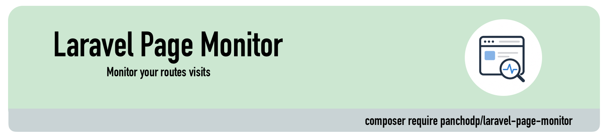

<p align="center"><a target="_blank"> </a></p>

<p align="center">
<a></a>
<a></a>
<a href="https://packagist.org/packages/panchodp/laravel-page-monitor"></a>
<a href="https://packagist.org/packages/panchodp/laravel-page-monitor"></a>
<a href="https://github.com/PanchoDP/laravel-page-monitor/actions/workflows/tests.yml"></a>
</p>

# Laravel Page Monitor

Monitor page visits in your Laravel application. Each visit is stored in the database with information about the user (authenticated or guest), device type, IP address, and timestamp.

## Compatibility

| Laravel | PHP  | Package |
|---------|------|---------|
| 13.x    | 8.4+ | ^1.x    |
| 12.x    | 8.4+ | ^1.x    |
| 11.x    | 8.4+ | ^1.x    |

## Installation

```bash
composer require panchodp/laravel-page-monitor
```

### Publish everything at once

```bash
php artisan vendor:publish --provider="Panchodp\LaravelPageMonitor\LaravelPageMonitorServiceProvider"
```

Or publish each piece individually:

```bash
# Migration
php artisan vendor:publish --provider="Panchodp\LaravelPageMonitor\LaravelPageMonitorServiceProvider" --tag="laravel-page-monitor-migrations"

# Configuration
php artisan vendor:publish --provider="Panchodp\LaravelPageMonitor\LaravelPageMonitorServiceProvider" --tag="laravel-page-monitor-config"

# Views
php artisan vendor:publish --provider="Panchodp\LaravelPageMonitor\LaravelPageMonitorServiceProvider" --tag="laravel-page-monitor-views"

# Assets (CSS/JS)
php artisan vendor:publish --provider="Panchodp\LaravelPageMonitor\LaravelPageMonitorServiceProvider" --tag="laravel-page-monitor-assets"
```

Then run the migration:

```bash
php artisan migrate
```

This creates the `page_visits` table with the following columns:

| Column | Description |
|---|---|
| `id` | Auto-increment primary key |
| `page` | Route name or full URL |
| `user_id` | Authenticated user ID, `null` for guests |
| `session_id` | Session identifier |
| `ip_address` | Visitor IP (supports IPv4 and IPv6) |
| `device_type` | `mobile`, `tablet`, or `desktop` |
| `user_agent` | Raw User-Agent string |
| `visited_at` | Visit timestamp |

## Configuration

Publish the configuration file:

```bash
php artisan vendor:publish --provider="Panchodp\LaravelPageMonitor\LaravelPageMonitorServiceProvider" --tag="laravel-page-monitor-config"
```

This creates `config/laravel_page_monitor.php`:

```php
return [
    'enabled'      => env('MONITOR_ENABLED', true),
    'user_model'   => env('PAGE_MONITOR_USER_MODEL', 'App\Models\User'),
    'middleware'   => ['web', 'auth'],
    'track_all'    => env('MONITOR_TRACK_ALL', false),
    'track_guests' => env('MONITOR_TRACK_GUESTS', true),
    'pruning' => [
        'retention_days' => env('MONITOR_RETENTION_DAYS', 30),
        'max_records'    => env('MONITOR_MAX_RECORDS', 10000),
    ],
    'per_page' => env('MONITOR_PER_PAGE', 50),
];
```

- `enabled`: Enable or disable the monitor globally. Defaults to `true`.
- `user_model`: The Eloquent model used to associate authenticated visits. Change this if your application uses a custom User model.
- `middleware`: Middleware applied to the `/page-monitor` dashboard route. Defaults to `['web', 'auth']`.
- `track_all`: When `true`, all routes in the `web` middleware group are tracked automatically — no need to add `visits-count` to each route manually. The `/page-monitor` dashboard is always excluded. Defaults to `false`.
- `track_guests`: When `false`, only visits from authenticated users are recorded. Guest visits are silently ignored. Defaults to `true`.
- `pruning`: Controls automatic cleanup of old records (see [Artisan Commands](#artisan-commands)).
- `per_page`: Number of records shown per page in the dashboard. Defaults to `50`.

```php
// Use a custom user model
'user_model' => 'App\Models\Admin',

// or via .env
PAGE_MONITOR_USER_MODEL=App\Models\Admin
```

## Usage

### 1. Track pages

**Option A — Track all pages automatically**

Set `track_all` to `true` in the config (or via `.env`) and every route in the `web` group is tracked with zero additional setup:

```env
MONITOR_TRACK_ALL=true
```

**Option B — Track specific routes manually**

Add the `visits-count` middleware only to the routes you want to monitor:

```php
// Single route
Route::get('/home', HomeController::class)->middleware('visits-count');

// Route group
Route::middleware('visits-count')->group(function () {
    Route::get('/home', HomeController::class);
    Route::get('/about', AboutController::class);
});
```

### 2. View the dashboard

Navigate to `/page-monitor` to see all recorded visits with page, user, device type, IP address, and timestamp.

The dashboard requires authentication by default (`auth` middleware). To restrict access further, define the `view-page-monitor` gate in your `AppServiceProvider`:

```php
use Illuminate\Support\Facades\Gate;

Gate::define('view-page-monitor', fn ($user) => $user->isAdmin());
```

You can also replace the middleware entirely via the config:

```php
// config/laravel_page_monitor.php
'middleware' => ['web', 'auth', 'role:admin'],
```

## Facade

You can query visit data anywhere in your application using the Facade:

```php
use Panchodp\LaravelPageMonitor\Facades\LaravelPageMonitor;

// Pages grouped and sorted by most visited first
$ranking = LaravelPageMonitor::ranking();

// Pages grouped and sorted alphabetically A → Z
$byName = LaravelPageMonitor::byNameOrder(desc: false);

// Pages grouped and sorted alphabetically Z → A
$byNameDesc = LaravelPageMonitor::byNameOrder(desc: true);
```

Each method returns an `Illuminate\Database\Eloquent\Collection` where each item contains `page`, `visits` (total count), and `last_visit`.

You can also query the `PageVisit` model directly for full control:

```php
use Panchodp\LaravelPageMonitor\Models\PageVisit;

// All visits for a specific page
PageVisit::where('page', 'home')->get();

// Visits by authenticated users only
PageVisit::whereNotNull('user_id')->with('user')->get();

// Visits from mobile devices today
PageVisit::where('device_type', 'mobile')
    ->whereDate('visited_at', today())
    ->get();
```

## Artisan Commands

### Prune old records

```bash
php artisan pagemonitor:prune
```

Deletes records based on the `pruning` config. Add it to your schedule for automatic cleanup:

```php
// routes/console.php
Schedule::command('pagemonitor:prune')->daily();
```

You can tune the limits in the config (or disable them with `null`):

```php
'pruning' => [
    'retention_days' => 30,    // delete visits older than 30 days
    'max_records'    => 10000, // keep at most 10,000 records
],
```

### Reset all visit records

```bash
php artisan pagemonitor:reboot-count
```

Deletes all recorded visits from the database.

## Contributing

Pull requests are welcome. For major changes, please open an issue first to discuss what you would like to change.

Please make sure to update tests as appropriate.

## License

[MIT](https://github.com/PanchoDP/laravel-page-monitor/blob/master/LICENSE.md)